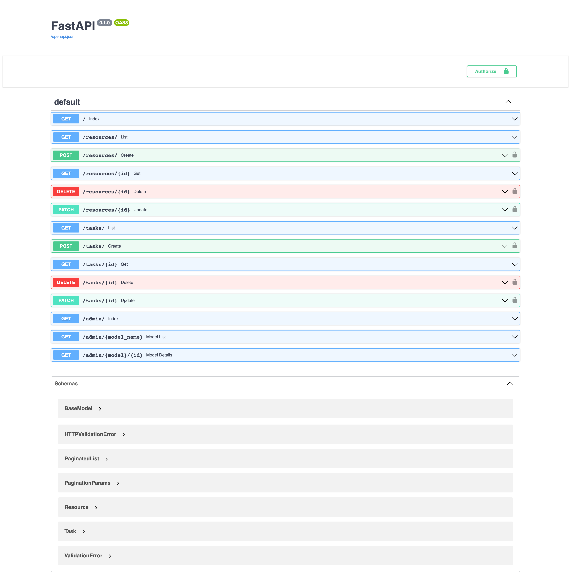
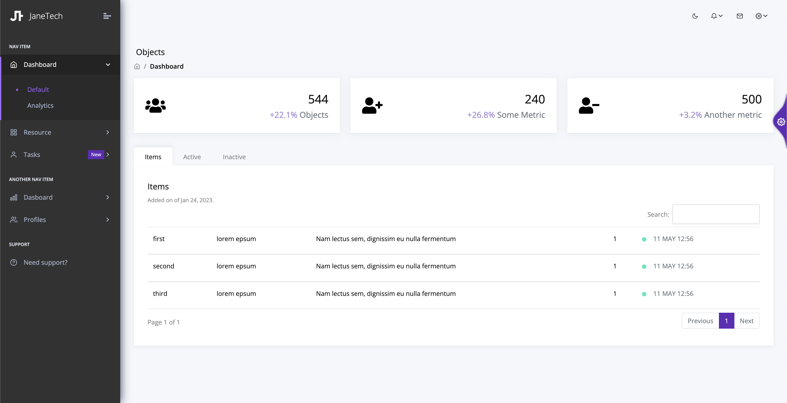
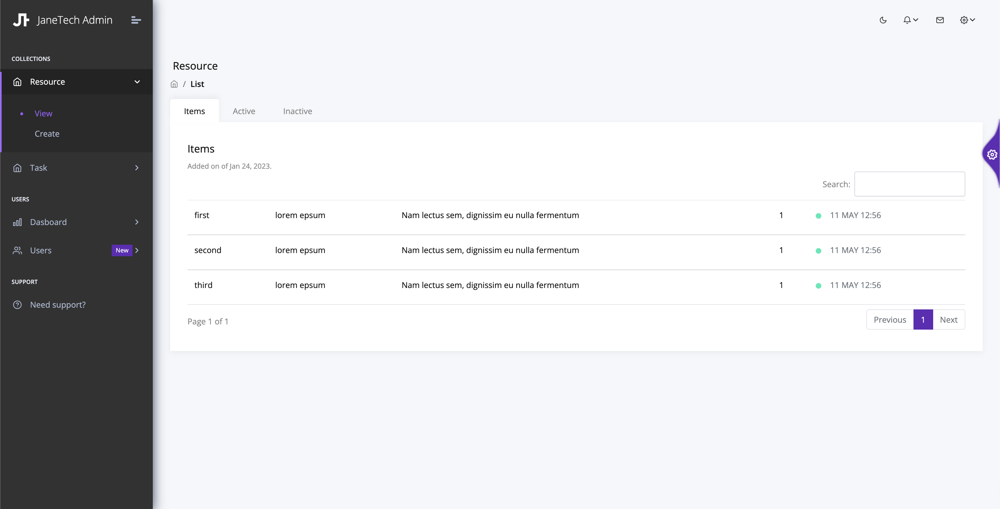

# Fasy API Admin Template


A test driven micro-service template to build and deploy a fast API service with Docker and on API Gateway / AWS Lambda.

This template also includes auto admin capabilities for models.

Check out the [live site]().

### API
 

### App Views

 

### Admin Views

 


## Components 

  - **Python** 
    - [`requirements.txt`](requirements.txt) 
    - linting and testing:
      - ```pre-commit```
      - ```pytest test```

  - **Docker** is used to run locally and in the cloud.
    - [`Dockerfile`](Dockerfile) Dockerfile with multi-architecture support 
    - [`docker-compose`](docker-compose.yml) API Gateway and Lambda functions built from docker image


  - **API** sample routes are mapped to:
    - ```GET /```
    - ```GET /resources``` 
    - ```POST /resources``` 
    - ```PUT /resources/{:id}```
    - ```DELETE /resources/{:id}```
  - 
    - ```GET /tasks``` 
    - ```POST /tasks``` 
    - ```PUT /tasks/{:id}```
    - ```DELETE /tasks/{:id}```

  - **Admin** routes are mapped to:
    - ```GET /admin/```
    - ```GET /admin/{:resource}```
    - ```GET /admin/{:resource}/{:id}```

  
  - **Serverless** API Gateway and functions mapped to lambda-web on cloud (HttpServer locally).
    - [`serverless.yml`](serverless.yml)

  - **Deployment** Actions to deploy on branch commits
    - [.github/workflows](.github/workflows/development.yml) Github actions 
      -  lint   [```feature```]
      -  test   [```feature```]
      -  deploy [```main```, ```production```]
      -  tag    [```production```]


  - **Views** Bootstrap 5 views based of the following templates
    - [templates](.github/workflows/development.yml) Github actions 


## Requirements

- [`FastAPI`](https://fastapi.tiangolo.com/features/)
- [`Node`](https://nodejs.org/en/download/)
- [`AWS CLI`](https://aws.amazon.com/cli/)

## Project Directory Structure

      ├── apps
            ├── api
                  ├── models
                  ├── routes
                  ├── services
            ├── views
      ├── tests
            ├── integration
            ├── unit
      ├── templates
            ├── accounts
            ├── admin
            ├── includes
            ├── layout
            ├── layout
      ├── static
            ├── assets
      ├── .github
            ├── workflows

        


## Creating a new service

Create a new service by selecting the button above :point_down:

 

> To setup your local environment:

    python -m venv venv
    . ./venv/bin/activate
    pip install -r requirements.txt


## Development

> While working on a feature to start the service locally run: 

      python apps/main.py 

> Or use docker 

      docker-compose up 
      docker-compose up --build

> Before you are ready to merge your feature, to test running lamnbda, you can run: 

      serverless offline 

### Adding a new route

> For CRUD applications, follow the example in [resource.rs](apps/api.routes/resource.rs) and add your resource route to: 
      
      apps/api/routes 

> For example if you are building an API to manage Users and Shares, you would create:
      
      apps/api/routes/users.rs
      apps/api/routes/shares.rs

### Adding a new model

> For admin enabled views, inherit from ```BaseAdmin```. Follow the example [resource.rs](apps/api/models/resource.rs) add your models:

      apps/api/models/users.rs
      apps/api/models/shares.rs


### Connecting to a source DB

TODO: Add DB support


### Adding views

Follow the example [resource/dashboard.html](templates/resource/dashboard.html) for a custom model view:

<br/>

## Test Driven Development

Before writing any functionality, we recommend you write your tests first. See the examples in:

- [unit](tests/unit.rs)
- [integration](tests/integration.rs)

To add tests, simply add to the appropriate package and using [automod]() it will be automatically detected to run.

> To run tests

      pytest test

> To run specific tests

      pytest test --package <package-name>

** When using actix-web modules, it is not recommended (or easy) to unit test a route module. Follow the example in [tests/integration/routes/resource.rs](tests/integration/routes/resource_test.rs) to add an route integration test.

<br/>

## Deploying
 
 ```aws configure``` has been run.

> To deploy locally:

    npm install
    serverless deploy
    
<br/>

## Continuous Integration

Github workflows are will trigger of off specific branches

- [feature.yml](.github/workflows/feature.yml): Lint and test worflows will run any time there is a push to any feature branch.
- [development.yml](.github/workflows/development.yml): Lint, test and deployment worflows will run any time there is a push to **main** branch.
- [production.yml](.github/workflows/production.yml): Lint, test, deployment and release worflows will run any time there is a push to **main** branch.


This project uses Github workflows.

You will need to configure a role in AWS for the github service to use. Follow the instructions [here](https://github.com/marketplace/actions/aws-assume-role-github-actions).


### Permissions

You may need to add more permissions to your role. Be as restrictive as possible when adding more permissions


<br/>


## Contributing to this template

If you have additions, changes, fixes, create a Pull Request and tag any reviewers and it will be reviewed promptly.

If you are having issues, create an issue and we will investigate.

